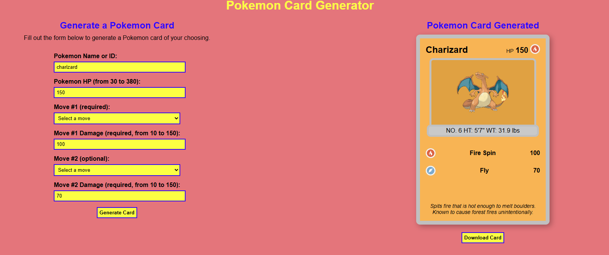

# Pokemon Card Generator

This is a simple web application that generates a Pokemon card based on user input. It fetches the relevant data from the PokeAPI and displays it in a Pokemon card. The card can be downloaded as an image, but it is not entirely perfect.

Try it out [here](https://tmatth11.github.io/api-day-project/)!
